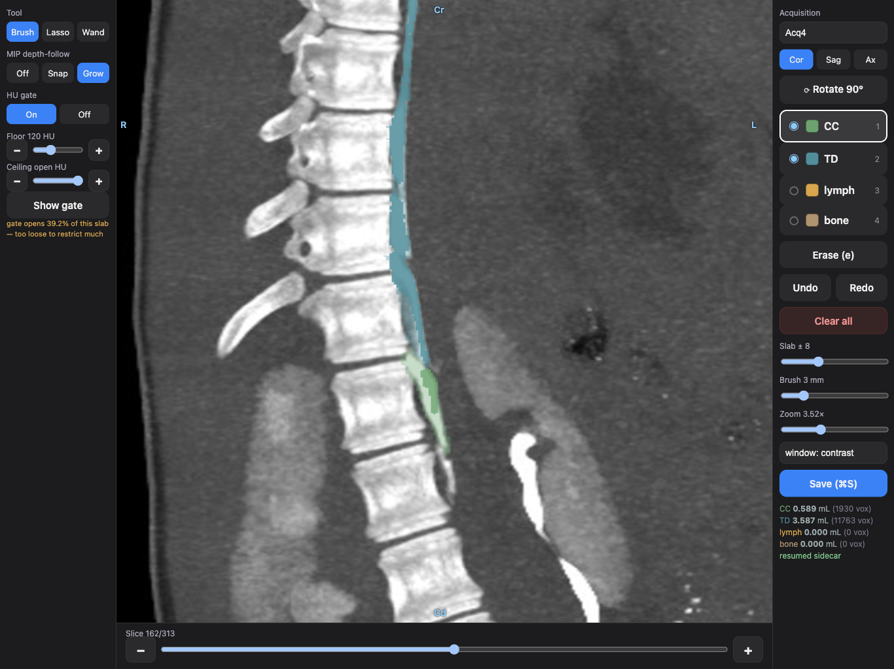
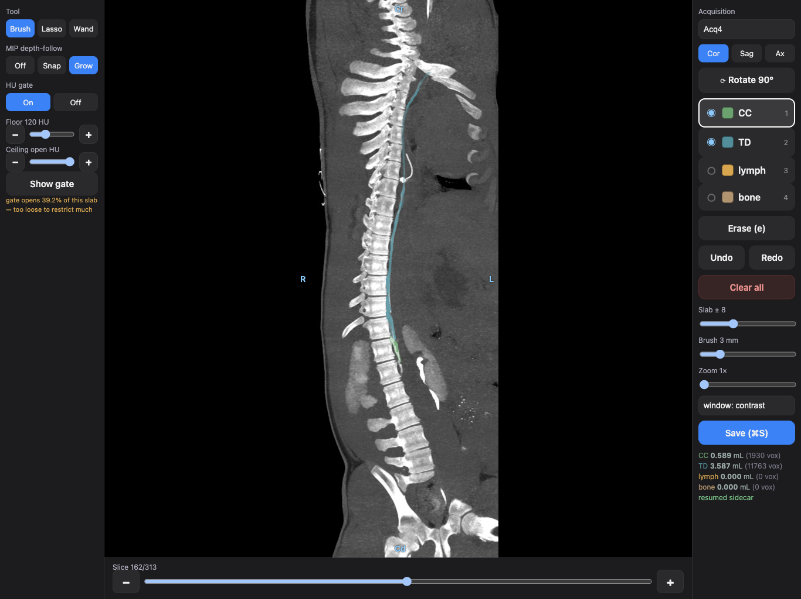
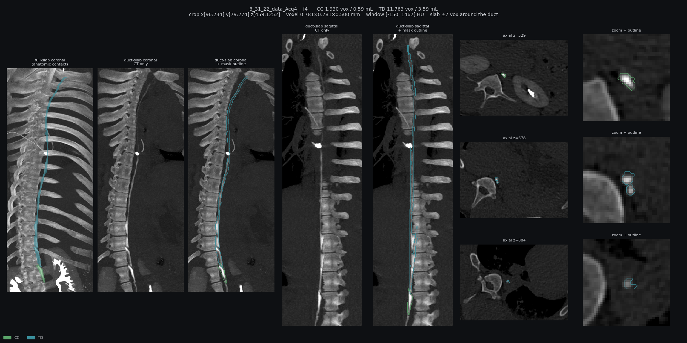

# Cisterna chyli & thoracic duct segmentation

Tools for hand-segmenting the **cisterna chyli (CC)** and the **thoracic duct (TD)** on
dynamic contrast-enhanced CT lymphangiography in pigs: a painter you draw on with an Apple
Pencil in iPad Safari, plus the quality-control, mask-merging and analysis code built around it.



*The painter, zoomed on the cisterna chyli where it runs into the thoracic duct. 8/31/22 Acq 4,
time frame 4 (peak contrast), coronal slab ±8 slices, cranial up. Solid colour marks the mask on
this exact slice; faint colour marks mask elsewhere in the slab.*

## What is in here

| | what it is | where |
|---|---|---|
| **Painter** | single-file web app: Apple Pencil in Safari, rendering on the computer that holds the data. Needs only `numpy` and `pillow` | [`src/cc_reservoir/viz/ipad_paint.py`](src/cc_reservoir/viz/ipad_paint.py) |
| QC sheet | one-page check of a mask against the CT: coronal and sagittal slabs that follow the duct, plus true axial cuts | [`scripts/render_qc_sheet.py`](src/cc_reservoir/scripts/render_qc_sheet.py) |
| Mask audit | classifies every saved mask as hand work or the automatic seed saved back unchanged | [`scripts/audit_edit_sidecars.py`](src/cc_reservoir/scripts/audit_edit_sidecars.py) |
| Mask merge | reconciles two generations of masks frame by frame, keeping hand work the newer copy lost | [`scripts/merge_mask_archives.py`](src/cc_reservoir/scripts/merge_mask_archives.py) |
| Analysis | CC volume over time, integrated-HU volume, partial-volume forward model and estimator | `measure/`, `forward/`, `estimator/`, `scripts/` |
| Deployment | launchers and sync scripts for the lab's shared drive | [`tools/`](tools/README.md) |

## The painter



- **The Pencil draws, fingers don't.** Two fingers pinch-zoom and pan; a resting palm does
  nothing. Slices change only through the scrub bar or the arrow keys.
- **Slab-MIP backdrop.** A thick slab shows a tortuous duct as one continuous streak; slab 0 is
  a single true CT slice for depth-exact edges.
- **Depth-follow.** A stroke on the slab lands on the slice where the duct actually is
  (*Snap*), and *Grow* also fills the contiguous run of slices the duct spans.
- **HU gate.** With a floor and ceiling set, a voxel is painted only if its HU falls inside the
  band, for every tool. *Show gate* washes the admitted voxels blue, and a readout says what
  fraction of the slab the band lets through.
- **Brush, lasso, wand.** Trace, circle loosely, or tap once to fill a connected in-band
  structure. Undo reverses a whole gesture.
- **Four labels:** 1 CC (green), 2 TD (teal), 3 lymph node (gold), 4 bone (tan). Coronal,
  sagittal and axial views, radiological convention, cranial up.
- **Per-frame save** to `f<N>_edit.npz`, stamped with whether the frame was actually edited.
- **Only image tiles cross the Wi-Fi.** The ~170 MB volume stays on the computer; the backdrop
  goes out as JPEG and the mask overlay as lossless PNG.

Run it on the computer that has the data, then open the printed URL on an iPad on the same
Wi-Fi (or at `http://127.0.0.1:8778/` on the computer itself):

```bash
pip install numpy pillow
PYTHONPATH=src python3 -m cc_reservoir.viz.ipad_paint path/to/context4d_<acquisition>/ --port 8778
```

The folder you pass is only the starting acquisition; every sibling `context4d_*` folder shows
up in the acquisition menu, ordered by acquisition time. `--selftest` runs the internal checks
without starting a server. The full manual (keyboard shortcuts, gate settings per contrast
agent, troubleshooting) is [`tools/painter_bundle/README.md`](tools/painter_bundle/README.md).

## Quality control

Every mask is checked on a sheet like this before it is used:



Left to right: a coronal projection through the whole crop for anatomic context; a coronal slab
that follows the duct (±7 voxels around it, re-centred on every axial slice), CT alone and with
the mask outlined; the same pair in sagittal; three true axial cuts, at the CC and at two TD
levels, each with a zoomed outline. The slabs are projections and can overlay structures that
are apart in depth; the axial cuts cannot. The header gives the CC and TD volumes, the crop,
voxel size and window.

```bash
python -m cc_reservoir.scripts.render_qc_sheet path/to/context4d_8_31_22_data_Acq4 f4
```

## Data format

The CT volumes and masks are not in this repository. Each acquisition is one folder:

| file | contents |
|---|---|
| `f<N>.npz` | one time frame: `hu` (int16 volume) and the builder's automatic `seg` (uint8) |
| `f<N>_edit.npz` | the hand-drawn mask: `seg` (uint8), plus provenance. Always wins over the `seg` inside `f<N>.npz` |
| `meta.npz` | voxel size in mm, frame count, peak frame, and the crop that maps the volume back onto the original DICOM grid (`crop_lo`, `crop_hi`, `raw_full_shape`) |

Axes are `[x, y, z]` = anterior→posterior, left→right, caudal→cranial.
Labels: `1` CC, `2` TD, `3` lymph node, `4` bone.

```python
import numpy as np

acq = "context4d_8_31_22_data_Acq4"
hu   = np.load(f"{acq}/f4.npz")["hu"]                        # int16 [x, y, z]
seg  = np.load(f"{acq}/f4_edit.npz")["seg"]                  # uint8, same shape
meta = np.load(f"{acq}/meta.npz", allow_pickle=True)

ml = float(np.prod(meta["voxel"])) / 1000.0                   # one voxel in mL
print("CC", (seg == 1).sum() * ml, "mL   TD", (seg == 2).sum() * ml, "mL")
```

`cc_reservoir.measure.context.place_seg_in_raw(seg, meta)` puts a mask back onto the full
DICOM grid (`raw_index = crop_lo + context_index` on each axis).

**CC volume and the CC/TD split are not comparable across sessions.** In the 07/20/22 and
09/07/22 masks the two labels sit on two parallel segments about 12 mm apart, and which of them is
the cisterna chyli is not settled; in the other sessions they are one tube cut at a plane.
CC + TD together is comparable everywhere.

## Layout

```
src/cc_reservoir/
  viz/        painter (ipad_paint.py), napari editor, viewers
  io/         DICOM, MAT and context-volume loaders
  measure/    lumen, volume, surface and mass measurements on the masks
  forward/    partial-volume forward model (geometry, PSF, imaging)
  estimator/  model fit and recovery
  scripts/    command-line entry points: build, render, audit, merge
tests/        pytest suite
tools/        launchers, sync scripts and READMEs deployed to the lab share
docs/         design specs, plans, README images
```

## Data source

The 2021–2022 sessions are the pig study in:

> Molloi S, Polivka AR, Zhao Y, Redmond J, Itkin M, Antunes I, Yu Z. Dynamic contrast-enhanced
> CT lymphangiography to quantify thoracic duct lymphatic flow. *Radiology*.
> 2023;309(3):e230959. [doi:10.1148/radiol.230959](https://doi.org/10.1148/radiol.230959)

The hand segmentations were painted by Egor Sidorov.

Shu Nie, Molloi Lab, University of California, Irvine.
